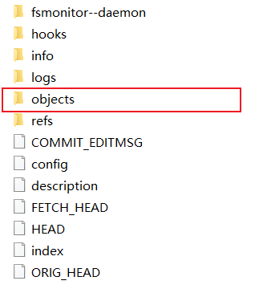

# test
git测试、教程；

This is branch win.


## git版本号

作用：

1. 避免文件冲突；
2. 定位文件位置；


版本文件在objects文件夹下



github采取SHA-1哈希算法，得到40位的版本号；

* 采取 `2 + 38` 的存储文件结构：前2位，作为文件夹名；后38位作为文件名；


### 查看版本文件

版本文件经过加密

```
# -p 代表友好的查看
git cat-file -p
```


### 添加 .gitignore 文件

若不希望将文件夹的一些敏感文件，上传到github中，可将该文件路径写入到`.gitignore`文件中

在项目根目录创建 `.gitignore` 文件:

>  路径以 `/` 开头

```
/.gitignore
/.idea/
```


## 分支

多分支合并

当本地和云端冲突后，能自动merge的就会合并了（比如，对于尾插的修改来说，很容易自动合并）。

若无法自动合并，自己编辑本地的文件，提交的时候，选择使用我的修改。
